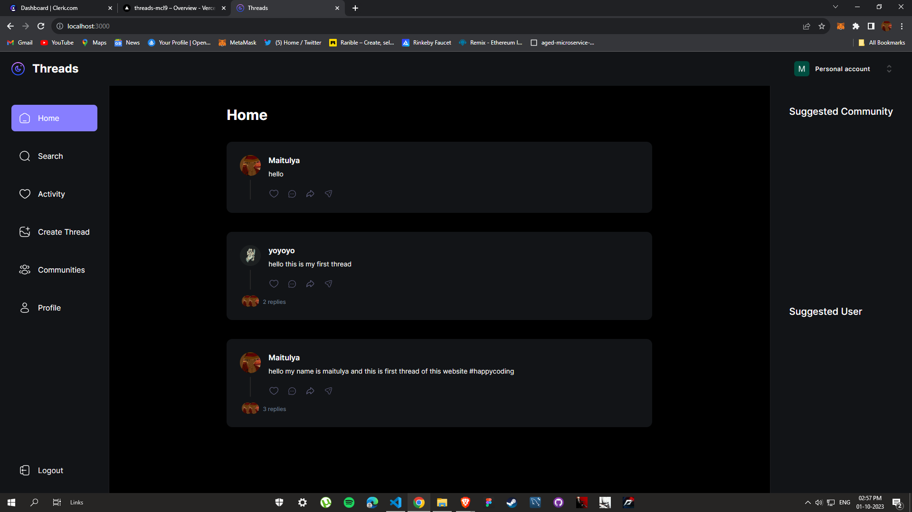
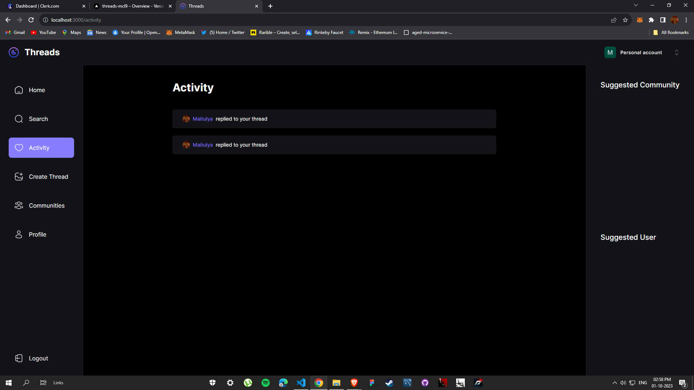
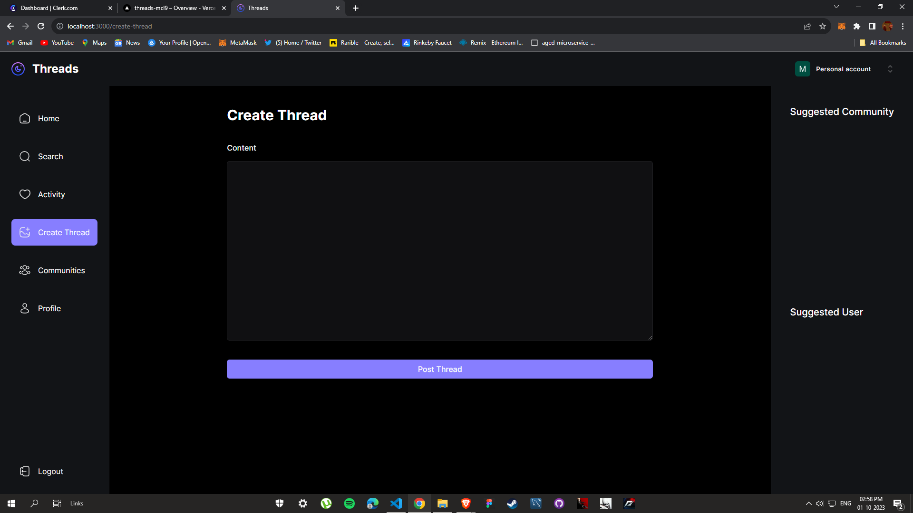
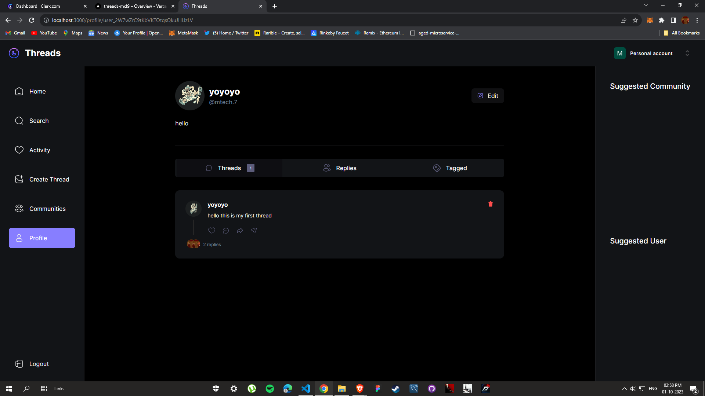
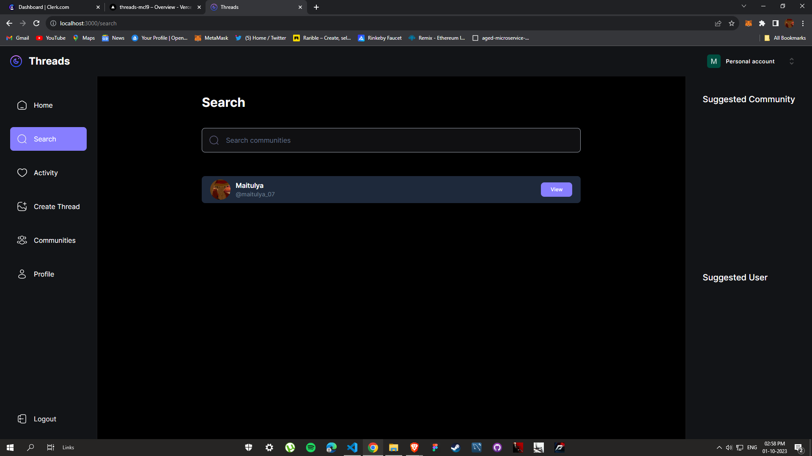
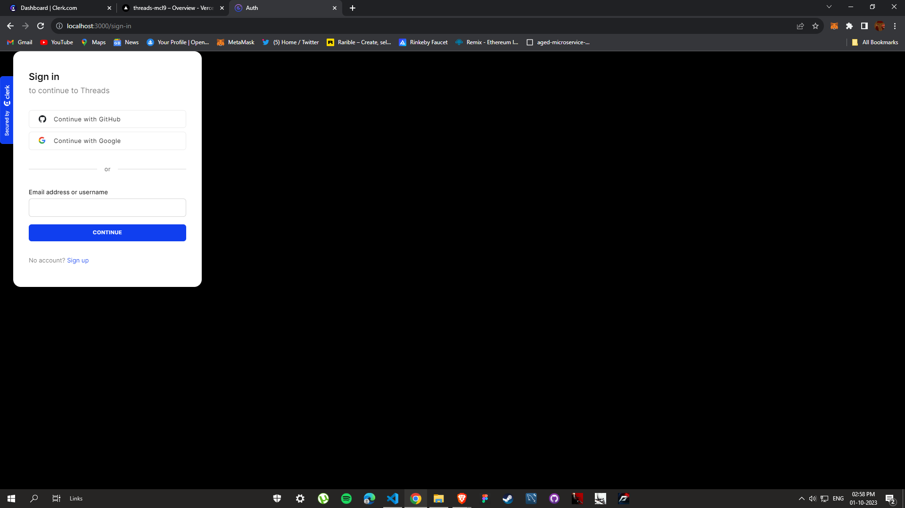
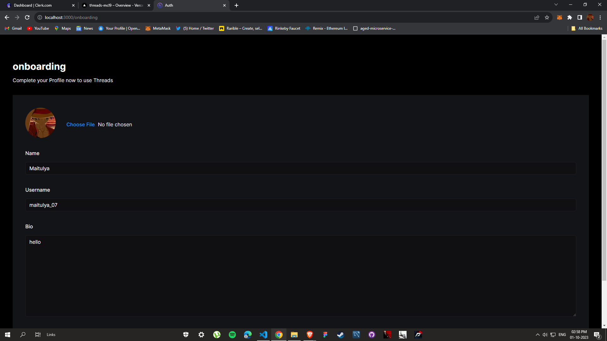

# Threads

Threads is a web application developed using Next.js, Clerk, Tailwind CSS, and MongoDB that aims to replicate the functionality of Facebook's Threads feature. It allows users to create and manage threads and engage in discussions with others.















## Features

Threads offers the following features:

- **User Authentication:** Utilizes Clerk for user authentication, allowing users to sign up, log in, and maintain their profiles.

- **Thread Creation:** Users can create new threads and provide detailed information such as titles and descriptions.

- **Discussion:** Threads facilitate discussions among users, allowing them to post comments and replies.

- **User Profiles:** Users have customizable profiles that include their names, usernames, profile images, and bios.

- **Responsive Design:** The user interface is designed to be responsive and accessible on various devices.

## Getting Started

To get started with Threads, follow these steps:

1. Clone this repository to your local machine:

   ```shell
   git clone https://github.com/your-username/threads.git
